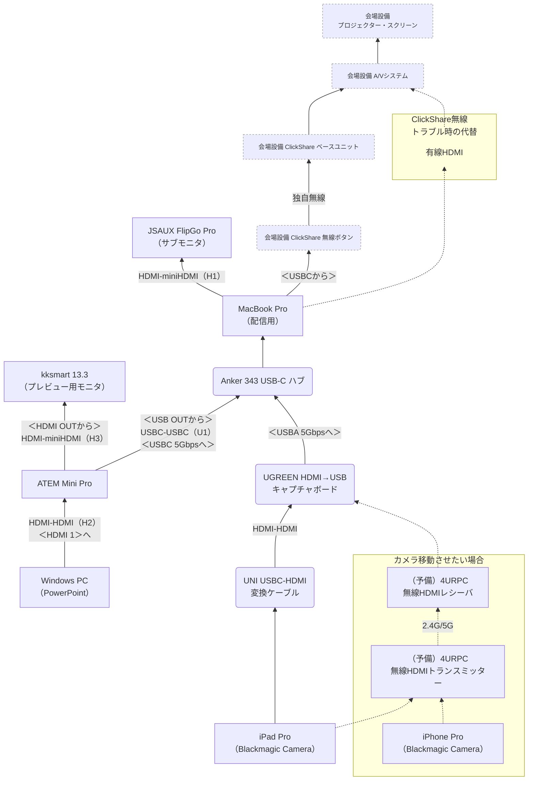
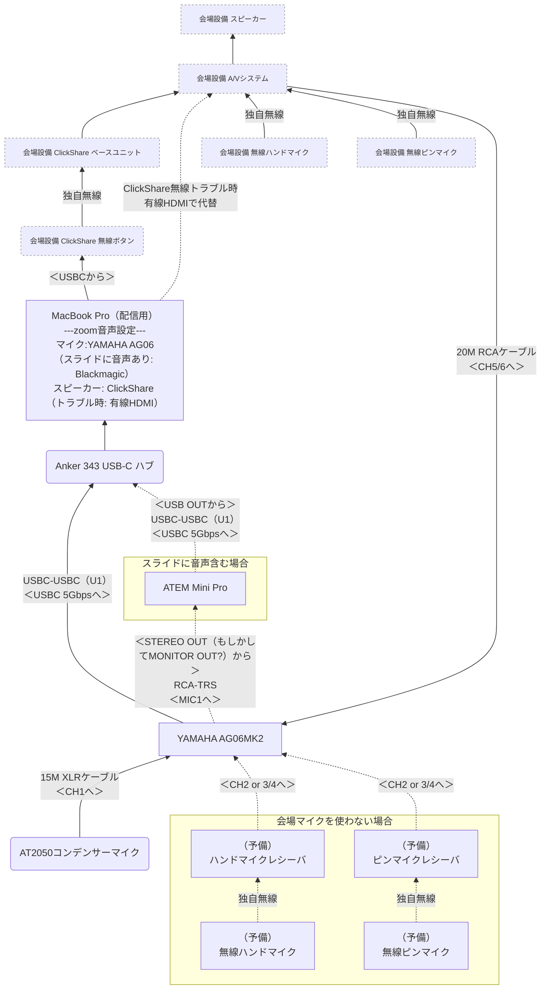
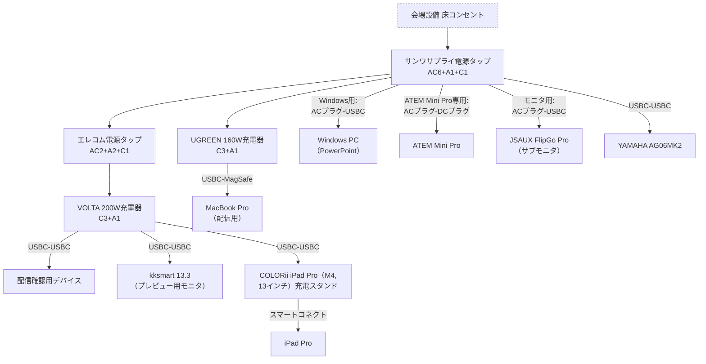
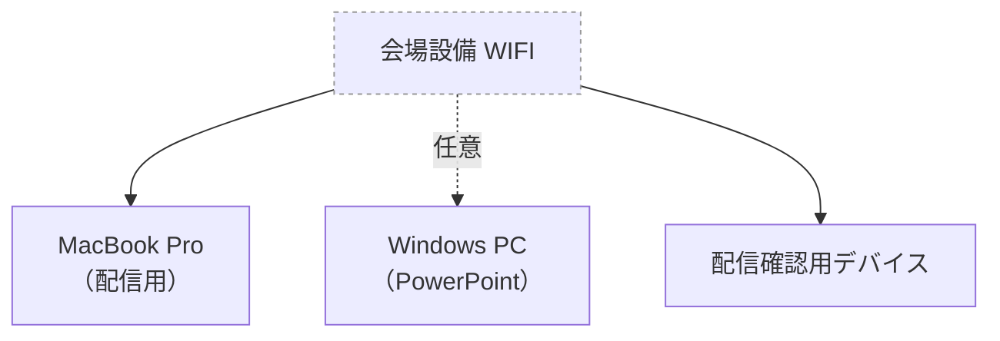

# システム構成（2026/01）

## 1. 映像の流れ

```mermaid

flowchart BT
  %% Video sources
  %% 持ち込み機材 (電源要)
  PC01[MacBook Pro<br>（配信用）]
  PC02[Windows PC<br>（PowerPoint）]
  ATEM[ATEM Mini Pro]
  VDT01[kksmart 13.3<br>（プレビュー用モニタ）]
  VDT02[JSAUX FlipGo Pro<br>（サブモニタ）]
  CAM01[iPad Pro<br>（Blackmagic Camera）]
  %% 持ち込み機材 (電源不要)  
  HUB01(Anker 343 USB-C ハブ)
  CNV01(UNI USBC-HDMI<br>変換ケーブル)
  CAP01(UGREEN HDMI→USB<br>キャプチャボード)
  %% 会場設備
  CS-C1(会場設備 ClickShare 無線ボタン):::note
  CS-B0[会場設備 ClickShare ベースユニット]:::note
  SYS[会場設備 A/Vシステム]:::note
  SYS-PJ/SC[会場設備 <br>プロジェクター・スクリーン]:::note
  %% 持ち込み機材 (予備機材)
  RX-HDMI[（予備）4URPC<br>無線HDMIレシーバ]
  TX-HDMI[（予備）4URPC<br>無線HDMIトランスミッター]

  %% 接続
  PC01 -->|HDMI-miniHDMI（H1）| VDT02
  PC02 -->|HDMI-HDMI（H2）<br>＜HDMI 1＞へ| ATEM
  ATEM -->|＜HDMI OUTから＞<br>HDMI-miniHDMI（H3）| VDT01
  ATEM -->|＜USB OUTから＞<br>USBC-USBC（U1）<br>＜USBC 5Gbpsへ＞| HUB01
  HUB01 --> PC01
  CAM01 --> CNV01
  CNV01 -->|HDMI-HDMI| CAP01
  CAP01 -->|＜USBA 5Gbpsへ＞| HUB01
  PC01 -->|＜USBCから＞| CS-C1
  CS-C1 -->|独自無線| CS-B0
  CS-B0 --> SYS
  SYS --> SYS-PJ/SC
 
  %% 接続(予備)
  %% 代替ルート1（ClickShareトラブル時）
  PC01 -.-> ALT_HDMI
  ALT_HDMI -.-> SYS
  subgraph SG1["ClickShare無線<br/>トラブル時の代替"]
    ALT_HDMI[<br>有線HDMI]:::ghost
  end
  %% 点を“見えなく”する（サイズ固定はできないが最小になる）
  classDef ghost fill:transparent,stroke:transparent:;

  %% 代替ルート2（カメラ移動させたい時 or リアルタイム性よりもケーブルレスにしたい時）
  CAM01 -.-> TX-HDMI
  RX-HDMI -.-> CAP01
  CAM02[iPhone Pro<br>（Blackmagic Camera）]
  subgraph SG2["カメラ移動させたい場合"]
    direction TB
    TX-HDMI -.->|2.4G/5G| RX-HDMI
    CAM02 -.-> TX-HDMI
  end
  
  %% クラス定義
  classDef note stroke:#999,stroke-dasharray: 3 3,font-size:12px;
```

## 2. 音声の流れ

```mermaid
flowchart BT
  %% 持ち込み機材 (要電源)
  AI/F[YAMAHA AG06MK2]
    subgraph SG1["スライドに音声含む場合"]
      ATEM[ATEM Mini Pro]
    end
  PC01[MacBook Pro（配信用）<br>---zoom音声設定---<br>マイク:YAMAHA AG06<br>（スライドに音声あり: Blackmagic）<br>スピーカー: ClickShare （トラブル時: 有線HDMI）]
  %% 持ち込み機材 (電源不要)  
  MIC-C(AT2050コンデンサーマイク)
  HUB01(Anker 343 USB-C ハブ)
  %% 会場設備
  CS-C1(会場設備 ClickShare 無線ボタン):::note
  CS-B0[会場設備 ClickShare ベースユニット]:::note
  SYS[会場設備 A/Vシステム]:::note
  SYS-MICCLH[会場設備 無線ハンドマイク]:::note
  SYS-MICCLP[会場設備 無線ピンマイク]:::note
  SYS-SPKR[会場設備 スピーカー]:::note
  %% 持ち込み機材 (予備機材)
  RCV-CLH[（予備）<br>ハンドマイクレシーバ]
  MIC-CLH[（予備）<br>無線ハンドマイク]
  RCV-CLP[（予備）<br>ピンマイクレシーバ]
  MIC-CLP[（予備）<br>無線ピンマイク]

  %% 接続
  MIC-C -->|15M XLRケーブル<br>＜CH1へ＞| AI/F
  SYS -->|20M RCAケーブル<br>＜CH5/6へ＞| AI/F
  AI/F -->|USBC-USBC（U1）<br>＜USBC 5Gbpsへ＞| HUB01
  HUB01 --> PC01
  PC01 -->|＜USBCから＞| CS-C1
  CS-C1 -->|独自無線| CS-B0
  CS-B0 --> SYS
  PC01 -.->|ClickShare無線トラブル時<br>有線HDMIで代替| SYS
  AI/F -.->|＜STEREO OUT（もしかしてMONITOR OUT?）から＞<br>RCA-TRS<br>＜MIC1へ＞| ATEM
  ATEM -.->|＜USB OUTから＞<br>USBC-USBC（U1）<br>＜USBC 5Gbpsへ＞| HUB01
  SYS-MICCLH -->|独自無線| SYS
  SYS-MICCLP -->|独自無線| SYS
  SYS --> SYS-SPKR

  %% 予備ルート（会場マイクを使わない）
  RCV-CLH -.->|＜CH2 or 3/4へ＞| AI/F
  RCV-CLP -.->|＜CH2 or 3/4へ＞| AI/F
  subgraph SG2["会場マイクを使わない場合"]
    direction TB
    MIC-CLH -.->|独自無線| RCV-CLH
    MIC-CLP -.->|独自無線| RCV-CLP
  end

  %% クラス定義
  classDef note stroke:#999,stroke-dasharray: 3 3,font-size:12px;
``` 

## 3. 電源

```mermaid
flowchart TD
  %% 持ち込み機材(電源)
  POWERSTRIP1[サンワサプライ電源タップ<br>AC6+A1+C1]
  POWERSTRIP2[エレコム電源タップ<br>AC2+A2+C1]
  AC/CHARGER1[UGREEN 160W充電器<br>C3+A1]
  AC/CHARGER2[VOLTA 200W充電器<br>C3+A1]
  %% 持ち込み機材(電源要)
  PC01[MacBook Pro<br>（配信用）]
  PC02[Windows PC<br>（PowerPoint）]
  PC03[配信確認用デバイス]
  ATEM[ATEM Mini Pro]
  VDT01[kksmart 13.3<br>（プレビュー用モニタ）]
  VDT02[JSAUX FlipGo Pro<br>（サブモニタ）]
  STAND[COLORii iPad Pro（M4,<br>13インチ）充電スタンド]
  CAM01[iPad Pro]
  AI/F[YAMAHA AG06MK2]
  %% 会場設備
  SYS-FLOOR[会場設備 床コンセント]:::note
  %% 接続
  SYS-FLOOR --> POWERSTRIP1
  POWERSTRIP1 -->|Windows用:<br>ACプラグ-USBC| PC02
  POWERSTRIP1 --> AC/CHARGER1
  POWERSTRIP1 --> POWERSTRIP2
  POWERSTRIP1 -->|USBC-USBC| AI/F
  POWERSTRIP1 -->|モニタ用:<br>ACプラグ-USBC| VDT02
  POWERSTRIP1 -->|ATEM Mini Pro専用:<br>ACプラグ-DCプラグ| ATEM
  POWERSTRIP2 --> AC/CHARGER2
 
  AC/CHARGER1 -->|USBC-MagSafe| PC01
  AC/CHARGER2 -->|USBC-USBC| VDT01
  AC/CHARGER2 -->|USBC-USBC| STAND
  AC/CHARGER2 -->|USBC-USBC| PC03
  STAND -->|スマートコネクト| CAM01
  
      %% クラス定義
  classDef note stroke:#999,stroke-dasharray: 3 3;
```

## 4. ネットワーク

```mermaid
flowchart TD
  %% 持ち込み機材(電源要)
  PC01[MacBook Pro<br>（配信用）]
  PC02[Windows PC<br>（PowerPoint）]
  PC03[配信確認用デバイス]
  %% 会場設備
  SYS-WIFI[会場設備 WIFI]:::note
  %% 接続
  SYS-WIFI --> PC01
  SYS-WIFI -.->|任意| PC02
  SYS-WIFI --> PC03

  %% クラス定義
  classDef note stroke:#999,stroke-dasharray: 3 3;
```
- 配信用PC01,オンライン(zoom)確認用デバイスは「会場Wi-Fi」に接続
- ClickShareは会場設置機器のため、ネットワーク要件は会場側に依存
