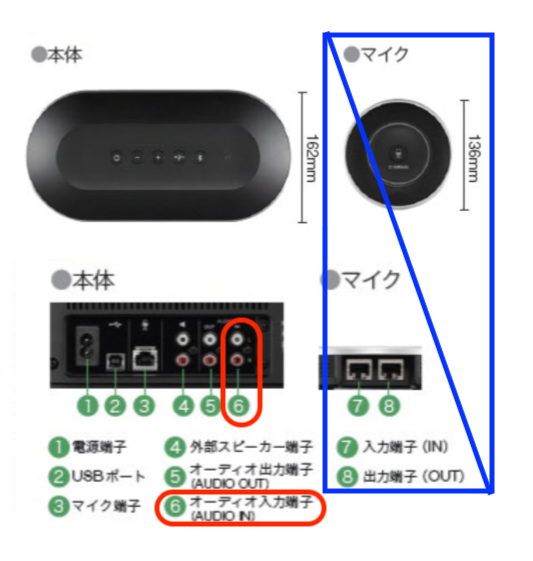
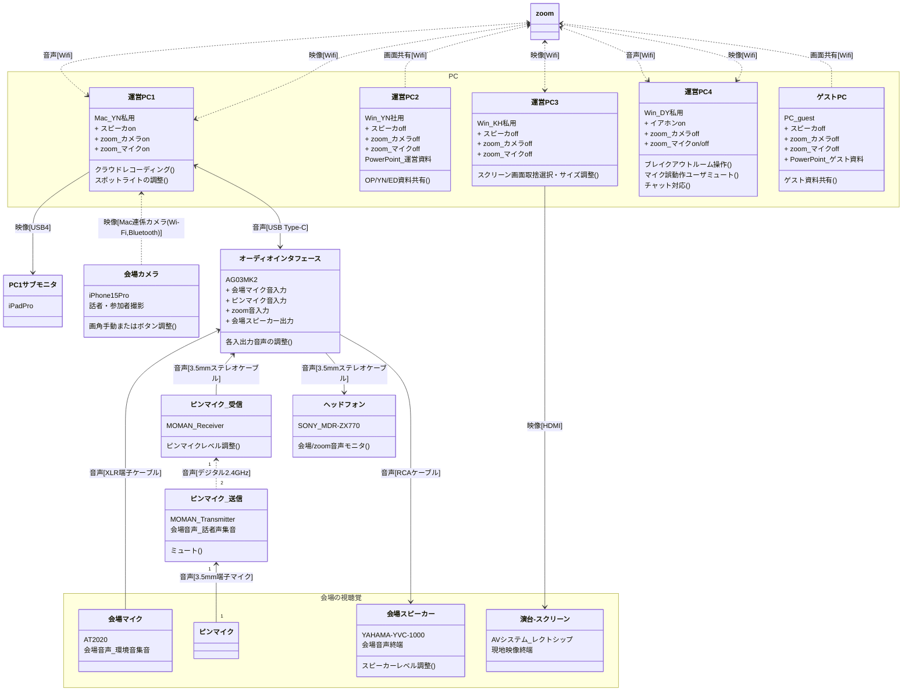

#  [HFC vol.47] Well-being HR

■インデックス
- [1. ロジスティクス](#1-ロジスティクス)
  - [1.1. 機材一覧](#11-機材一覧)
    - [1.1.1. ピンマイク送信機](#111-ピンマイク送信機)
    - [1.1.2. ピンマイク受信機＋オーディオインタフェース](#112-ピンマイク受信機オーディオインタフェース)
    - [1.1.3. 会場スピーカー](#113-会場スピーカー)
    - [1.1.4. 運営PC1](#114-運営pc1)
    - [1.1.5. 運営PC2](#115-運営pc2)
    - [1.1.6. 運営PC3](#116-運営pc3)
    - [1.1.7. 運営PC4](#117-運営pc4)
  - [1.2. 配線図(映像・音声)](#12-配線図映像音声)
  - [1.3. 配線図(電源)](#13-配線図電源)
- [2. 香盤表](#2-香盤表)
- [前日までに事前に試すこと。](#前日までに事前に試すこと)
- [当日事前に試すこと。](#当日事前に試すこと)

## 1. ロジスティクス

### 1.1. 機材一覧
| #  | 機材名               | 用途                | 持込者,手配者 | カテゴリ/メーカー| 備考 |
|----|-------------------|-------------------|---------|-----------|----|
| 1  | [運営PC1](#運営PC1) | zoom配信操作          | YN      | Mac       |    |
| 2  | PC1サブモニタ          | 作業画面エリア拡大         | YN      | iPad      |    |
| 3  | USB4ケーブル          | Mac-iPad接続        | YN      | USBケーブル   |    |
| 4  | USBハブ             | MacのUSB接続拡張       | YN      | Anker     |    |
| 5  | [オーディオインタフェース](#オーディオインタフェース)| 音声コントロール   | YN   | AG03   |    |
| 6  | USB-C & USB-Aケーブル | AG03の電源           | YN      | USBケーブル   |    |
| 7  | USB Type-Cケーブル    | Mac-AG03接続        | YN      | USBケーブル   |    |
| 8  | ヘッドフォン            | 音声モニタ             | YN      | ヘッドフォン    |    |
| 9  | 3.5mmステレオケーブル     | AG03-ヘッドフォン接続     | YN      | 音声ケーブル    |    |
| 10 | 会場マイク             | 会場環境音用            | YN      | AT2020    |    |
| 11 | XLR端子ケーブル         | AG03-AT2020接続     | YN      | 音声ケーブル    |    |
| 12 | マイク三脚             | AT2020の足          | YN      | 三脚        |    |
| 13 | [ピンマイク送信機](#ピンマイク送信機)x2 | 無線マイクの各ユニット       | YN      | MOMAN     | |
| 14 | [ピンマイク受信機](#ピンマイク受信機)x1      | 無線マイクの各ユニット       | YN      | MOMAN     |    |
| 15 | 3.5mm端子マイクx2      | 無線マイク送信ユニット側      | YN      | 音声ケーブル    |    |
| 16 | 3.5mmステレオケーブル     | AG03-MOMAN受信機接続   | YN      | 音声ケーブル    |    |
| 17 | [会場スピーカー](#会場スピーカー) | 会場参加者用スピーカー       | YS      | YAMAHA    |    |
| 18 | RCAケーブル           | AG03-YAMAHA接続     | YN      | 音声ケーブル    |    |
| 19 | 延長コード             | 後方各機材の電源用         | YN      | 電源コード     |    |
| 20 | 充電器               | 後方各機材の電源用         | YN      | GIGA      |    |
| 21 | [運営PC2](#運営PC2)+電源コード       | 運営資料共有用PC         | YN      | WinPC     |    |
| 22 | ゲストPC+電源コード       | ゲスト資料共有用PC        | ゲスト     | WinPC     |    |
| 23 | 電源タップ             | 前方ステージPCの電源用      | YN      | Anker     |    |
| 24 | [運営PC3](#運営PC3)+電源コード       | スクリーン投影           | KH      | WinPC     |    |
| 25 | HDMIケーブル          | 運営PC3-演台接続        | YS      | 映像ケーブル    |    |
| 26 | [運営PC4](#運営PC4)+電源コード       | zoom参加者対応         | DY      | WinPC     |    |
| 27 | 演台(会議システム)        | スクリーン投影           | YS      | 設備        |    |
| 28 | プロジェクタ            | スクリーン投影           | YS      | 設備        |    |
| 29 | スクリーン             | スクリーン投影           | YS      | 設備        |    |
| 30 | 会場カメラ             | 会場撮影              | YN      | iPhonePro |    |
| 31 | ジンバル              | iPhoneの水平・三脚      | YN      | Insta360  |    |
| 32 | USB Type-Cケーブル    | iPhone-Insta360接続 | YN      | USBケーブル   |    |
| 33 | 会場照明・電源・Wifi・空調   | レクトシップの各インフラ      | YS      | 設備        |    |
| 34 | カメラ三脚             | 写真撮影時利用           | YN      | 三脚        |

---

#### 1.1.1. ピンマイク送信機
- 話者が身につけるピンマイク
- 使用者の注意点 :
  - 話さない間はミュートボタンを短押ししてミュートにしておく。
- 画像説明

  

#### 1.1.2. ピンマイク受信機＋オーディオインタフェース
- 音響レベル調整(ピンマイク受信機, オーディオインタフェース)
- 音響担当者がやること・ドラブルシュート(ケース別) : 
  1. ハウリングが発生した
       - ゲストや運営の無線ピンマイク(か会場有線マイク)が原因。ハウリングの代表的な対処はマイクのスイッチをOFFにすること。
         ピンマイク起因なら③のダイヤルを0に、会場マイクが原因なら②のMUTEスイッチを点灯させる。
         どちらか分からない場合は両方実施。ハウリングが止まったらすぐにダイヤルやスイッチを元に戻すこと。
         でないとzoom側(=動画アーカイブ)に全く声が乗らない状態になってしまう。
  1. ヘッドフォンでモニタリングしている会場の環境音が大きすぎる・小さすぎる
       - ①のフェーダーを上下して音量を調節する。
  1. グループワークなどが始まり、zoom側に会場の雑音を載せたくない。
       - ②のMUTEスイッチを押して点灯させる。ワークが終わったら再度押して消灯させること。
  1. ヘッドフォンやスピーカーから出る、ゲストと運営の声が大きすぎる・小さすぎる
       - ③のダイヤルを回して音量を調節する
  1. ヘッドフォンやスピーカーから出る、ゲストと運営の声のバランスが違いすぎる
       - 受信機側面の④のAまたはBのボタンのうち、小さい声の主が使っているマイクに対応した方のレベルを増やす。
  1. ヘッドフォンやスピーカーから出る、zoom側の音量が大きすぎる・小さすぎる
       - ⑤のダイヤルを回して音量を調整する。
  1. スピーカーから出る音量が全体的に大きすぎる・小さすぎる。各音源のバランスは問題ない。
       - ⑥のダイヤルを回して音量を調整する。
  1. ヘッドフォンでモニタしている音量が全体的に大きすぎる・小さすぎる。各音源のバランスは問題ない。
       - ⑦のダイヤルを回して音量を調整する。
  1. 音量バランス以前に、特定音源が聞こえない。
       - 画像の緑色部分のセッティングや配線の両端の抜けを確認する。
         zoom音源問題の場合、配信用PC(Mac)のソフトウェア(zoom)やOSの設定を確認する。
- 画像説明

#### 1.1.3. 会場スピーカー
- 現地話者とzoom話者の声を拡声して会場参加者に届けるためのスピーカー
- 設定上の注意点 :
  - 付属の「マイク」「USBケーブル」「Ethernetケーブル」は使わない。
  - 本体上部の音量ボタン(+/-)はセッティング時に最大にしておく。本番中はオーディオインタフェースのダイヤルで調整。
  - Bluetooth接続は使わない。なお、Bluetoothやusb接続時に本体上部のミュートボタンを押すと、意図せずzoomのマイクミュートになるので注意。
- 画像説明 

  

#### 1.1.4. 運営PC1
- zoom配信操作のためのPC。zoomの管理者ユーザ想定。
- 運営PC1担当者がやること・ドラブルシュート(ケース別) : 
  1. 準備
     - 他運営PCとゲストPCのzoomに共同ホストを付与する。
  2. イベント開始時(と終了時)
     - クラウドレコーディングの開始(と終了)
  3. イベント中
     -  zoomで注目を浴びるべき話者(カメラ映像)にスポットライトを設定する。

#### 1.1.5. 運営PC2
- 運営資料共有のためのPC
- 運営PC2担当者がやること・ドラブルシュート(ケース別) : 
  1. オープニング時、クロージング時
       - 運営のスライド資料をzoomで画面共有。発表タイミングでページ送り。終わったら画面共有を切る。

#### 1.1.6. 運営PC3
- スクリーン投影のためのPC
- 運営PC3担当者がやること・ドラブルシュート(ケース別) : 
  1. イベント中
       - イベントの流れに合わせて、スクリーンに映す「画面共有」「会場カメラ」「zoomの参加者」の表示枠の位置や大きさを調整する。(zoomの操作コンソールなどはできるだけ表示させない。音声のみ参加者は表示しない設定。)

#### 1.1.7. 運営PC4
- zoom参加者対応のためのPC
- 運営PC4担当者がやること・ドラブルシュート(ケース別) : 
  1. 準備
       - 全運営PCの表示名を「★運営PCn」のように変える。PC4についてはzoom参加者が個別チャットできるようzoom対応など付けても良い。
  2. イベント中
       - ブレイクアウトルームの「メンバー割り振り」「時間設定〜ルームオープン」「各部屋への案内文送付」
       - チャットへの対応
       - 誤操作などでイベントを妨げる雑音ユーザのマイクミュート

### 1.2. 配線図(映像・音声)
映像・音声観点での配線およびタスクを説明する。クラス図の形式だが、実線が物理接続・破線がワイヤレス接続を示している。

----

### 1.3. 配線図(電源)
電源観点での配線を図示する。

----
## 2. 香盤表
                     凡例...◇：機材
| # | 時刻    | 式次第                    | YS                 | YN                                              | DY     | KH     | Y&S                          | サポート1(Aszk)                | サポート2(Haru) |
|---|-------|------------------------|--------------------|-------------------------------------------------|--------|--------|--------------------------------|--------------------------|-----------|
| 1 |       | 準備                     |                    |                                                 |        |        |                                |                          |           |
| 2 |       | 客入れ                    | ◇ピンマイク1            | ◇運営PC1 ◇オーディオインタフェース                        | ◇運営PC４ | ◇運営PC３ |                                |                          | 受付・集金     |
| 3 | 14:00 | OP                     | ◇運営PC2 ◇ピンマイク1 | ◇運営PC1 ◇オーディオインタフェース ◇会場カメラ ◇ピンマイク2 | ◇運営PC４ | ◇運営PC３ |                                | ◇オーディオインタフェース ◇運営PC1 |           |
| 4 |       | YNパート                  | ◇会場カメラ             | ◇運営PC2 ◇ピンマイク2                              | ◇運営PC４ | ◇運営PC３ |  ◇ピンマイク1                   | ◇運営PC1 ◇オーディオインタフェース |           |
| 5 |       | ゲストパート                 | ◇会場カメラ             | ◇運営PC1 ◇オーディオインタフェース                        | ◇運営PC４ | ◇運営PC３ | ◇ゲストPC ◇ピンマイク1 ◇ピンマイク2 | ◇オーディオインタフェース ◇運営PC1 |           |
| 6 |       | ゲストパート (ケータリング受取時) | ケータリング受取           | ◇会場カメラ                                          | ◇運営PC４ | ◇運営PC３ | ◇ゲストPC ◇ピンマイク1 ◇ピンマイク2 | ◇オーディオインタフェース ◇運営PC1 | ケータリング受取  |
| 7 |       | ED                     | ◇運営PC2 ◇ピンマイク1 | ◇運営PC1 ◇オーディオインタフェース ◇会場カメラ             | ◇運営PC４ | ◇運営PC３ |                                |                          |           |
| 8 | 16:00 | 片付け                    |

## 前日までに事前に試すこと。
・画面共有をPC2で、喋りをPC1、スポットライトをPC1に当てた時、クラウドレコーディングが画面はPC2・カメラとマイクがPC1になることを確認する。

## 当日事前に試すこと。
・