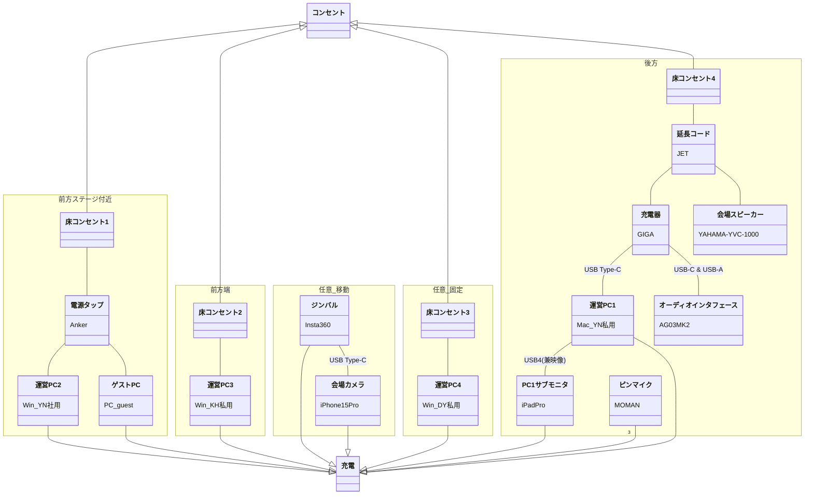

#  [HFC vol.47] Well-being HR

■インデックス
- [\[HFC vol.47\] Well-being HR](#hfc-vol47-well-being-hr)
  - [ロジスティクス](#ロジスティクス)
    - [機材一覧](#機材一覧)
    - [配線図(映像・音声)](#配線図映像音声)
    - [配線図(電源)](#配線図電源)
  - [香盤表](#香盤表)

## ロジスティクス

### 機材一覧
| #  | 機材名               | 用途                | 持込者,手配者 | カテゴリ      | 備考 |
|----|-------------------|-------------------|---------|-----------|----|
| 1  | 運営PC1             | zoom配信操作          | YN      | Mac       |    |
| 2  | PC1サブモニタ          | 作業画面エリア拡大         | YN      | iPad      |    |
| 3  | USB4ケーブル          | Mac-iPad接続        | YN      | USBケーブル   |    |
| 4  | USBハブ             | MacのUSB接続拡張       | YN      | Anker     |    |
| 5  | オーディオインタフェース      | 音声コントロール          | YN      | AG03      |    |
| 6  | USB-C & USB-Aケーブル | AG03の電源           | YN      | USBケーブル   |    |
| 7  | USB Type-Cケーブル    | Mac-AG03接続        | YN      | USBケーブル   |    |
| 8  | ヘッドフォン            | 音声モニタ             | YN      | ヘッドフォン    |    |
| 9  | 3.5mmステレオケーブル     | AG03-ヘッドフォン接続     | YN      | 音声ケーブル    |    |
| 10 | 会場マイク             | 会場環境音用            | YN      | AT2020    |    |
| 11 | XLR端子ケーブル         | AG03-AT2020接続     | YN      | 音声ケーブル    |    |
| 12 | マイク三脚             | AT2020の足          | YN      | 三脚        |    |
| 13 | ピンマイクx3           | 無線マイクの各ユニット       | YN      | MOMAN     |    |
| 14 | 3.5mm端子マイクx2      | 無線マイク送信ユニット側      | YN      | 音声ケーブル    |    |
| 15 | 3.5mmステレオケーブル     | AG03-MOMAN受信機接続   | YN      | 音声ケーブル    |    |
| 16 | 会場スピーカー           | 会場参加者用スピーカー       | YS      | YAMAHA    |    |
| 17 | RCAケーブル           | AG03-YAMAHA接続     | YN      | 音声ケーブル    |    |
| 18 | 延長コード             | 後方各機材の電源用         | YN      | 電源コード     |    |
| 19 | 充電器               | 後方各機材の電源用         | YN      | GIGA      |    |
| 20 | 運営PC2+電源コード       | 運営資料共有用PC         | YN      | Win       |    |
| 21 | ゲストPC+電源コード       | ゲスト資料共有用PC        | ゲスト     | Win       |    |
| 22 | 電源タップ             | 前方ステージPCの電源用      | YN      | Anker     |    |
| 23 | 運営PC3+電源コード       | スクリーン投影           | KH      | Win       |    |
| 24 | HDMIケーブル          | 運営PC3-演台接続        | YS      | 映像ケーブル    |    |
| 25 | 運営PC4+電源コード       | zoom参加者対応         | DY      | Win       |    |
| 26 | 演台(会議システム)        | スクリーン投影           | YS      | 設備        |    |
| 27 | プロジェクタ            | スクリーン投影           | YS      | 設備        |    |
| 28 | スクリーン             | スクリーン投影           | YS      | 設備        |    |
| 29 | 会場カメラ             | 会場撮影              | YN      | iPhonePro |    |
| 30 | ジンバル              | iPhoneの水平・三脚      | YN      | Insta360  |    |
| 31 | USB Type-Cケーブル    | iPhone-Insta360接続 | YN      | USBケーブル   |    |
| 32 | 会場照明・電源・Wifi・空調   | レクトシップの各インフラ      | YS      | 設備        |    |
| 33 | カメラ三脚             | 写真撮影時利用           | YN      | 三脚        |

### 配線図(映像・音声)
映像・音声観点での配線およびタスクを説明する。

説明文...TBD

----

### 配線図(電源)
電源観点での配線を図示する。

説明文...TBD

----
## 香盤表
                     凡例...◇：機材
| # | 時刻    | 式次第                    | YS                 | YN                                              | DY     | KH     | Y&S                          | サポート1(Aszk)                | サポート2(Haru) |
|---|-------|------------------------|--------------------|-------------------------------------------------|--------|--------|--------------------------------|--------------------------|-----------|
| 1 |       | 準備                     |                    |                                                 |        |        |                                |                          |           |
| 2 |       | 客入れ                    | ◇ピンマイク1            | ◇運営PC1 ◇オーディオインタフェース                        | ◇運営PC４ | ◇運営PC３ |                                |                          | 受付・集金     |
| 3 | 14:00 | OP                     | ◇運営PC2 ◇ピンマイク1 | ◇運営PC1 ◇オーディオインタフェース ◇会場カメラ ◇ピンマイク2 | ◇運営PC４ | ◇運営PC３ |                                | ◇オーディオインタフェース ◇運営PC1 |           |
| 4 |       | YNパート                  | ◇会場カメラ             | ◇運営PC2 ◇ピンマイク2                              | ◇運営PC４ | ◇運営PC３ |  ◇ピンマイク1                   | ◇運営PC1 ◇オーディオインタフェース |           |
| 5 |       | ゲストパート                 | ◇会場カメラ             | ◇運営PC1 ◇オーディオインタフェース                        | ◇運営PC４ | ◇運営PC３ | ◇ゲストPC ◇ピンマイク1 ◇ピンマイク2 | ◇オーディオインタフェース ◇運営PC1 |           |
| 6 |       | ゲストパート (ケータリング受取時) | ケータリング受取           | ◇会場カメラ                                          | ◇運営PC４ | ◇運営PC３ | ◇ゲストPC ◇ピンマイク1 ◇ピンマイク2 | ◇オーディオインタフェース ◇運営PC1 | ケータリング受取  |
| 7 |       | ED                     | ◇運営PC2 ◇ピンマイク1 | ◇運営PC1 ◇オーディオインタフェース ◇会場カメラ             | ◇運営PC４ | ◇運営PC３ |                                |                          |           |
| 8 | 16:00 | 片付け                    |

